# Configuration Manual

This configuration manual provides a detailed step by step guide on how
to build the detection system used in this project. It describes the
host and virtual environment setup, the installation and configuration
of all components used in the project, the deployment of the custom
detection rules and the steps required to setup the three experimental
conditions.

# Architecture Overview

The detection system contains two virtual machines that are connected
through an isolated host-only network. The first virtual environment
(Linux server) runs the detection platform and the second virtual
machine (Windows server) acts as the monitored endpoint. Telemetry is
collected through two separate paths.

+----------------------+--------------------------+-------------------+
| > **Component**      | > **Host**               | **Role**          |
+----------------------+--------------------------+-------------------+
|                      |                          |                   |
+----------------------+--------------------------+-------------------+
| >                    | > Linux server           | Storage, search,  |
| Elasticsearch+Kibana |                          | and Kibana        |
|                      |                          | detection engine  |
+----------------------+--------------------------+-------------------+
|                      |                          |                   |
+----------------------+--------------------------+-------------------+
| Logstash             | > Linux server           | Receives          |
|                      |                          | Winlogbeat        |
|                      |                          | telemetry         |
+----------------------+--------------------------+-------------------+
|                      |                          |                   |
+----------------------+--------------------------+-------------------+
| > Wazuh Manager      | > Linux server           | Receives agent    |
|                      |                          | events, applies   |
|                      |                          | custom rules, and |
|                      |                          | generate alerts   |
+----------------------+--------------------------+-------------------+
|                      |                          |                   |
+----------------------+--------------------------+-------------------+
| > Filebeat           | > Linux server           | Forwards Wazuh    |
|                      |                          | alerts            |
+----------------------+--------------------------+-------------------+
|                      |                          |                   |
+----------------------+--------------------------+-------------------+
| > Sysmon             | > Windows endpoint       | Generate process, |
|                      |                          | network, and file |
|                      |                          | telemetry         |
+----------------------+--------------------------+-------------------+
| > Winlogbeat         | > Windows endpoint       | Forwards Sysmon   |
|                      |                          | and windows       |
|                      |                          | channel to        |
|                      |                          | Logstash          |
+----------------------+--------------------------+-------------------+
| > Wazuh agent        | > Windows endpoint       | Forwards security |
|                      |                          | events and alerts |
|                      |                          | to Wazuh Manager  |
+----------------------+--------------------------+-------------------+

: Table 1 : System components

# Prerequisites

## Host Machine

-   A physical host that can run two virtual machines simultaneously is
    required. The host should have at least 16 GB RAM.

-   It should have at least 4 physical CPU and 120 GB of free disk.

-   Oracle VirtualBox installed on the host.

## Virtual Machines

-   The Linux analysis server was set up with 7 GB RAM, 4 CPU, and 70 GB
    storage.

-   The windows endpoint was set up with 4 GB RAM, 4 CPU, and 50 GB
    storage.

## Tools Installed 

+----------------------+--------------------------+-------------------+
| > **Tool Name**      | > **Version Used**       | **Where It Runs** |
+----------------------+--------------------------+-------------------+
|                      |                          |                   |
+----------------------+--------------------------+-------------------+
| > Oracle VirtualBox  | > Version 7.0.18 r162988 | Host              |
|                      | > (Qt5.15.2)             |                   |
+----------------------+--------------------------+-------------------+
|                      |                          |                   |
+----------------------+--------------------------+-------------------+
| Java                 | > OpenJDK version 21.0.8 | Linux analysis    |
|                      |                          | server            |
+----------------------+--------------------------+-------------------+
|                      |                          |                   |
+----------------------+--------------------------+-------------------+
| > Elastic Stack      | > 8.19.16                | Linux analysis    |
| > (Elasticsearch,    |                          | server            |
| > Kibana, Logstash)  |                          |                   |
+----------------------+--------------------------+-------------------+
|                      |                          |                   |
+----------------------+--------------------------+-------------------+
| > Wazuh agent        | > 4.14.5                 | Windows endpoint  |
+----------------------+--------------------------+-------------------+
|                      |                          |                   |
+----------------------+--------------------------+-------------------+
| > Wazuh Manager      | > 4.14.1                 | Linux analysis    |
|                      |                          | server            |
+----------------------+--------------------------+-------------------+
| > Filebeat           | > 8.19.16                | Linux analysis    |
|                      |                          | server            |
+----------------------+--------------------------+-------------------+
| > Winlogbeat         | > 9.4.2                  | Windows endpoint  |
+----------------------+--------------------------+-------------------+
| > Sysmon             | > v15.20                 | Windows endpoint  |
+----------------------+--------------------------+-------------------+
| > Sysmon             | > 4.90                   | Windows endpoint  |
| > configuration      |                          |                   |
+----------------------+--------------------------+-------------------+
| > Kali Linux         | > 2025.3                 | Linux analysis    |
| > (analysis server   |                          | server            |
| > OS)                |                          |                   |
+----------------------+--------------------------+-------------------+
| > Windows Server     | > 10.0.26100 N/A Build   | Windows endpoint  |
| > 2025 (endpoint OS) | > 26100                  |                   |
+----------------------+--------------------------+-------------------+

: Table 2: Required tools to be installed

# Implementation

The implementation flow is described in the diagram below

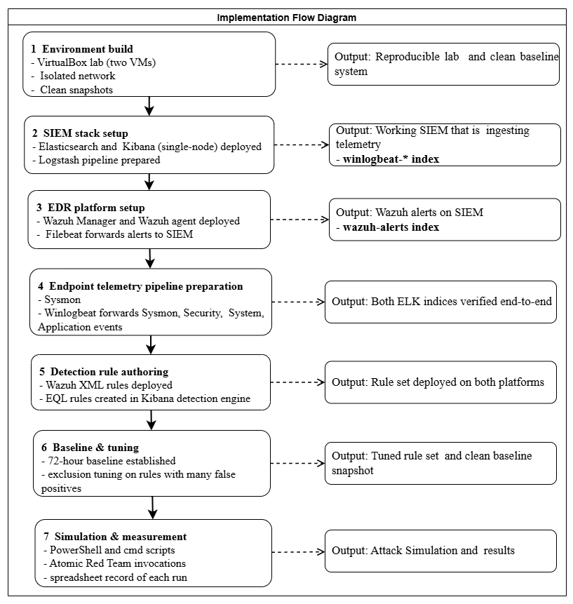

Figure 1: Implementation flow

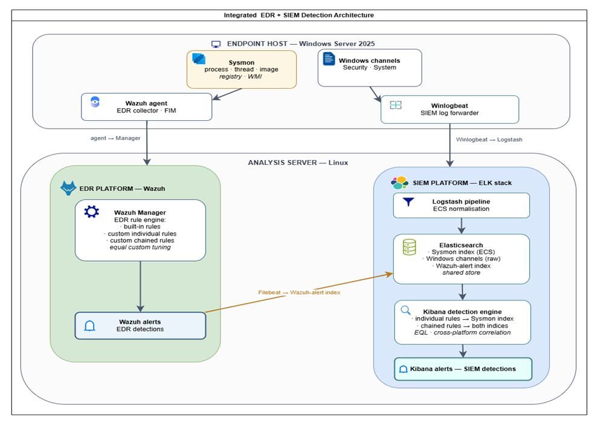

Figure 2: System Architecture

# Network and Virtual Machine Setup

-   Create two virtual machines in VirtualBox.

-   Create an internal network and assign it to both VMs as shown in the
    screenshot below.

-   Set static IP address for both machines.

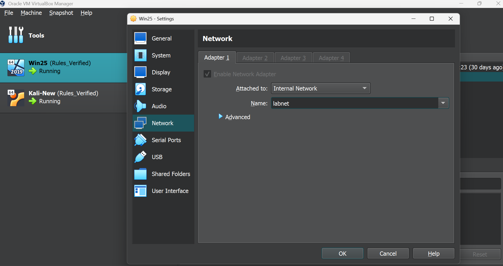

Figure 3: Network setting for the VMs

# Building the Analysis Server

Install the tools listed on Table 2 that are needed on the Linux
analysis server based on their dependency. First install Java, then
Elasticsearch and Kibana, then continue with Logstash setup, finally the
Wazuh Manager and Filebeat.

## Elasticsearch and Kibana Setup

-   Install Elasticsearch and Kibana as a single-node deployment.

-   After installation, both services should be enabled using the below
    commands:

*systemctl enable elasticsearch*

*systemctl enable kibana*

-   After enabling them start the services using the below commands:

*systemctl start elasticsearch*

*systemctl start kibana*

-   Verify the services are running as follows:

For Elasticsearch: curl -k <https://localhost:9200>

For Kibana: access the address https:localhost:5601 on a browser

-   Elasticsearch should return a JSON banner with its version and
    Kibana must display its login page.

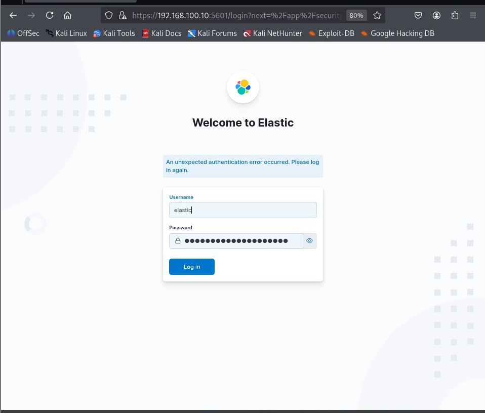

Figure 4: Kibana service login page

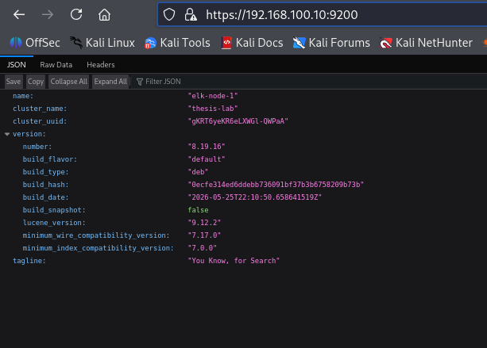

Figure 5: Elasticsearch status

## Logstash and Pipeline Setup

-   Install Logstash.

-   Update the Logstash configuration file with Beats as input and
    Elasticsearch as the output.

-   After updating the configuration, enable and start the service as
    follows:

*systemctl enable logstash*

*systemctl start logstash*

-   Confirm Logstash is listening for Beats input as follows:

*ss -tlnp \|grep 5044*

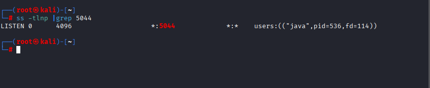

Figure 6: A running Logstash service

## Wazuh Manager and Filebeat Installation

-   Install the Wazuh Manager, enable and start the service.

-   Install Filebeat.

-   Configure Filebeat to forward Wazuh alerts to Elasticsearch as
    *wazuh-alerts-\** index.

-   Enable and start the Filebeat service.

-   Verify the Wazuh Manager and Filebeat is running.

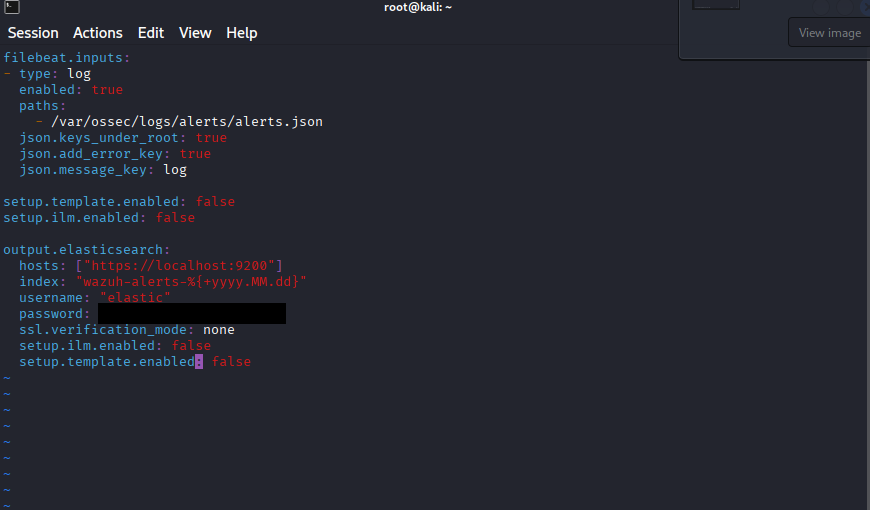

Figure 7: Filebeat configuration

# Building the Windows Endpoint 

Install the tools listed on Table 2 that are required for the Windows
endpoint.

## Sysmon Setup 

-   Download and install Sysmon.

-   Download the Olaf Hartong Sysmon configuration from Github.

-   Apply the settings from the downloaded configuration file to Sysmon
    as follows:

*.\\Sysmon64.exe -accepteula -I sysmonconfig.xml*

-   Confirm Sysmon is running.

## Winlogbeat Setup

-   Download and install winlogbeat.

-   Update the winlogbeat configuration file to contain.

    -   Sysmon event logs.

    -   Windows Security, Application and System events.

    -   Its output to be the Logstash endpoint.

-   Start it as a windows service.

> 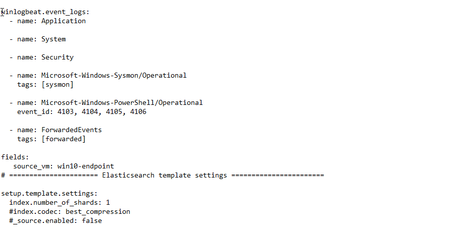

Figure 8: Winlogbeat configuration showing collected channels

> 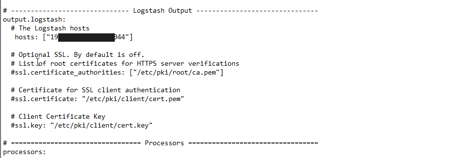

Figure 9: Winlogbeat configuration for sending output to Logstash

## Wazuh Agent Setup

-   Install the Wazuh agent.

-   Register it on the Wazuh Manager.

-   Update the configuration file to forward Sysmon channel to the Wazuh
    Manager as well.

-   Verify the agent is registered on the Wazuh Manager.

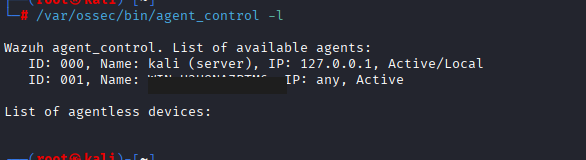

Figure 10: Wazuh agent registered on the Wazuh Manager

# Verify All Telemetry in Kibana

After all configurations are successful on both the analysis and
endpoint side, confirm that the telemetry is reaching kibana. Check if
the indexes registered on kibana are receiving events from the endpoint.

-   Go to Kibana Discover.

-   Select the appropriate index for the Data View value.

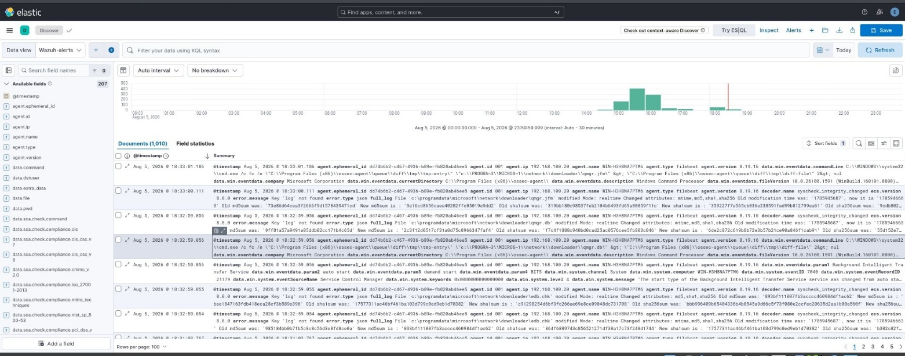

Figure 11: Wazuh event data arriving in Elasticsearch

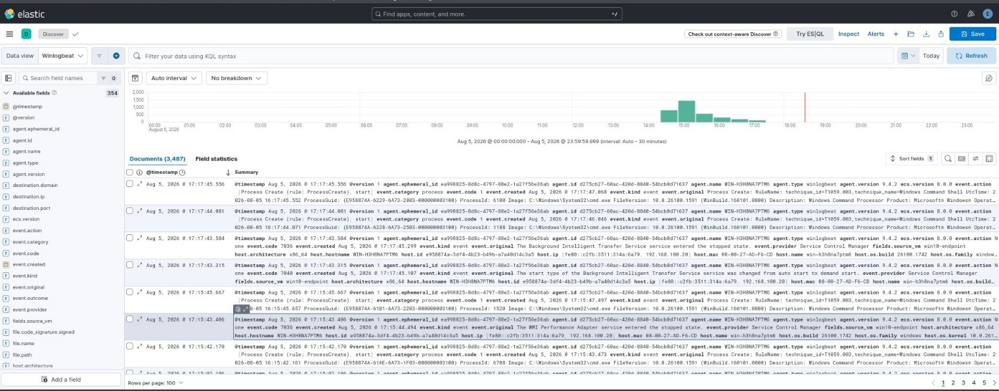

Figure 12: Sysmon and windows channel event arriving in Elasticsearch

# Deploying the Detection Rules

The detection rules are implemented in two locations, custom XML rule on
the Wazuh Manager and EQL correlation rules in Kibana DetectionEengine.
The complete rule set is provided in the table below.

+----------------+-----------------------+------------+---------------+
| > **Rule       | > **Detection Focus** | >          | **ATT&CK      |
| > Family**     |                       |  **Primary | Mapping**     |
|                |                       | > Source** |               |
+----------------+-----------------------+------------+---------------+
|                |                       |            |               |
+----------------+-----------------------+------------+---------------+
| > Encoded      | > PowerShell launched | > Sysmon   | T1059.001     |
| > PowerShell   | > with an             | > process  |               |
|                | > encoded-command     | > creation |               |
|                | > flag                |            |               |
+----------------+-----------------------+------------+---------------+
|                |                       |            |               |
+----------------+-----------------------+------------+---------------+
| > Mshta proxy  | > Mshta executing a   | > Sysmon   | T1218.005     |
| > execution    | > remote or inline    | > process  |               |
|                | > script              | > creation |               |
+----------------+-----------------------+------------+---------------+
|                |                       |            |               |
+----------------+-----------------------+------------+---------------+
| > WMI child    | > Interpreter/LOLBin  | > Sysmon   | T1047         |
| > process      | > spawned by the WMI  | > pa       |               |
|                | > service             | rent-child |               |
+----------------+-----------------------+------------+---------------+
|                |                       |            |               |
+----------------+-----------------------+------------+---------------+
| > Reflective   | > Remote thread       | > Sysmon   | T1055.001     |
| > injection    | > creation into       | > remote   |               |
|                | > another process     | > thread   |               |
|                |                       | > event    |               |
+----------------+-----------------------+------------+---------------+
|                |                       |            |               |
+----------------+-----------------------+------------+---------------+
| > Regsvr32     | > Regsvr32 executing  | > Sysmon   | T1218.010     |
| > scriptlet    | > a remote scriptlet  | > process  |               |
|                | > (squiblydoo)        | > creation |               |
+----------------+-----------------------+------------+---------------+
| > WMI event    | > WMI persistence via | > Sysmon   | T1546.003     |
| > subscription | > event subscription  | > WMI      |               |
|                |                       | > events   |               |
+----------------+-----------------------+------------+---------------+
| > Alternate    | > Payload hidden in   | > Sysmon   | T1564.004     |
| > data streams | > an                  | > f        |               |
|                | >                     | ile-stream |               |
|                | > NTFS alternate data | > event    |               |
|                | > stream              |            |               |
+----------------+-----------------------+------------+---------------+
| > Registry     | > Logging disabled    | > Sysmon   | T1562.002     |
| > logging      | > via registry        | > registry |               |
| > tamper       | > modification        | > event    |               |
+----------------+-----------------------+------------+---------------+
| > File         | > Suspicious file     | > Wazuh    | T1105         |
| > integrity    | > written to a        | > FIM      |               |
| > staging      | > staging location    |            |               |
+----------------+-----------------------+------------+---------------+
| > Chained      | > Ordered multi stage | > Sysmon   | Composite of  |
| > r            | >                     | > and      | the above     |
| ules-SIEM(EQL) | > sequence on one     | > Wazuh    |               |
|                | > host within a time  | > alert    |               |
|                | > window across both  | > index    |               |
|                | > index               | > (EQL     |               |
|                |                       | >          |               |
|                |                       |  sequence) |               |
+----------------+-----------------------+------------+---------------+
| > Chained      | > Ordered multi stage | > Wazuh    | Composite of  |
| > rules-       | > sequences via rule  | > rule     | the above     |
| > EDR(Wazuh)   | > chaining            | > chaining |               |
|                |                       | >          |               |
|                |                       | (timeframe |               |
|                |                       | > bounded) |               |
+----------------+-----------------------+------------+---------------+
|                |                       |            |               |
+----------------+-----------------------+------------+---------------+

: Table 3: List of detection rules

## Wazuh Custom Rules

-   Open the local rules file (*/var/ossec/etc/rules/local_rules.xml*)
    and add custom rule set to it.

-   Test syntax before restarting the Wazuh Manager service:

*/var/ossec/bin/wazuh-logtest -t*

-   Restart the Wazuh Manager.

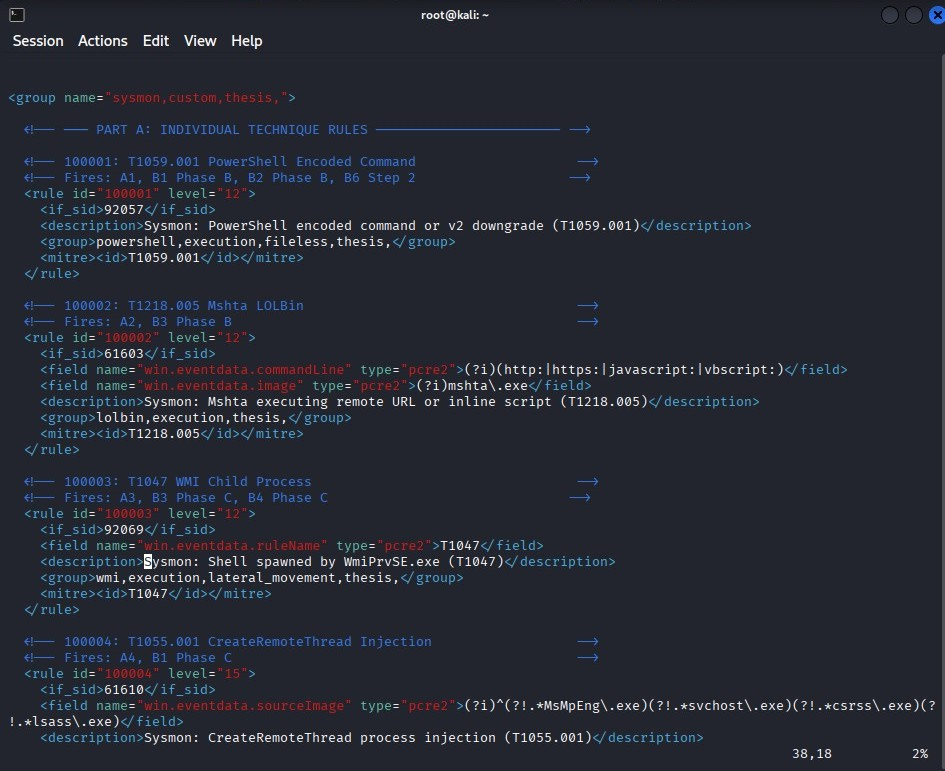

Figure 13: Wazuh local_rules.xml file

## EQL Rules Setup in Kibana

-   Open Kibana at <https://localhost:5601>

-   Go to Security Rules Detection Rules Create new rule.

-   Select Event correlation as the rule type.

-   Set the index pattern: winlogbeat-\* for individual rules, or
    winlogbeat-\* and wazuh-alerts-\* for cross source chained rules.

-   Add the EQL rule.

-   Set the rule name, MITRE ATT&CK tag, and severity level.

-   Set the schedule to run every minute and with a look back window.

-   Click save and enable.

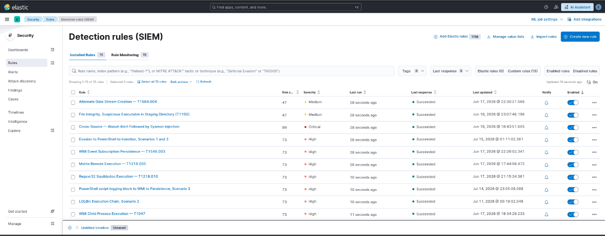

Figure 14: EQL custom rule set

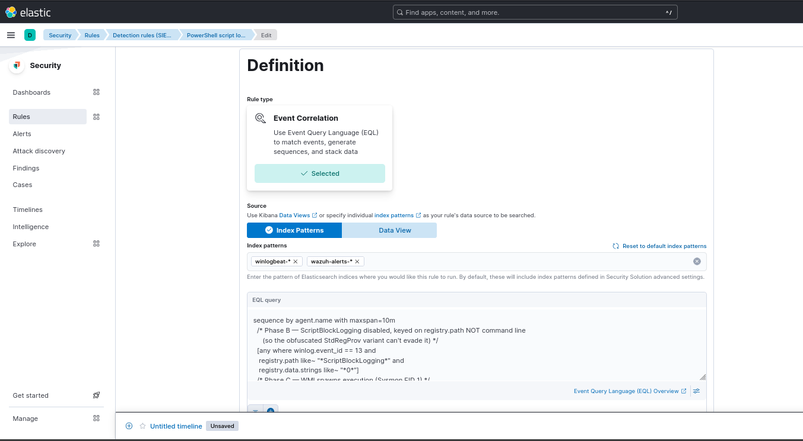

Figure 15: EQL rule creation window

# Configuring the Experimental Conditions

The three conditions are achieved by enabling and disabling the Wazuh
agent service (WazuhSvc) and winlogbeat service.

+------------------+------------------------------+-------------------+
| > **Condition**  | > **Service State**          | **What Generates  |
|                  |                              | Alerts**          |
+------------------+------------------------------+-------------------+
|                  |                              |                   |
+------------------+------------------------------+-------------------+
| A.  Wazuh EDR    | WazuhSvc running, winlogbeat | Wazuh custom      |
|     only         | stopped                      | rules             |
+------------------+------------------------------+-------------------+
|                  |                              |                   |
+------------------+------------------------------+-------------------+
| B.  ELK only     | WazuhSvc Stopped, winlogbeat | EQL rules in      |
|                  | running                      | Kibana with       |
|                  |                              | winlogbeat-\*     |
|                  |                              | index only        |
+------------------+------------------------------+-------------------+
|                  |                              |                   |
+------------------+------------------------------+-------------------+
| C.  Integrated   | WazuhSvc running, winlogbeat | Both platforms    |
|                  | running                      | simultaneously    |
+------------------+------------------------------+-------------------+
|                  |                              |                   |
+------------------+------------------------------+-------------------+

: Table 4: Experimental conditions setup

# Investigating Alerts

-   To examine the alerts generated, go to Security Alerts.

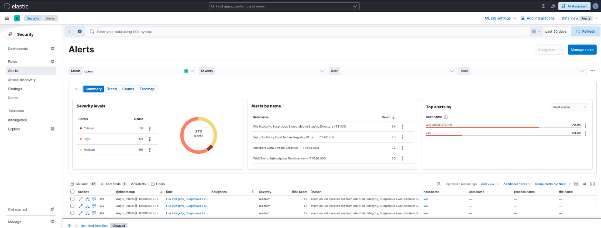

Figure 16: Alerts page

-   Select the alert detail to investigate a specific alert, especially
    process tree alerts.

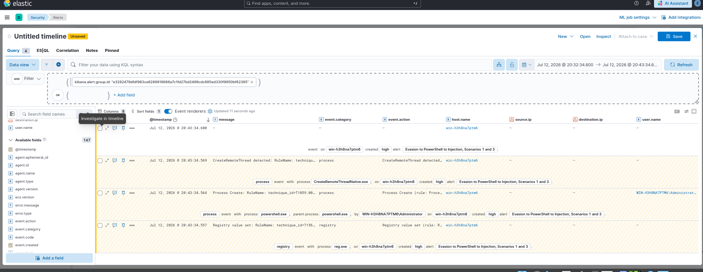

Figure 17: Alert timeline investigating window

-   The Kibana Dev tool can also be used to investigate alerts using
    tailored EQL queries. Go to Management Dev Tools Add query on the
    shell section Run the query.

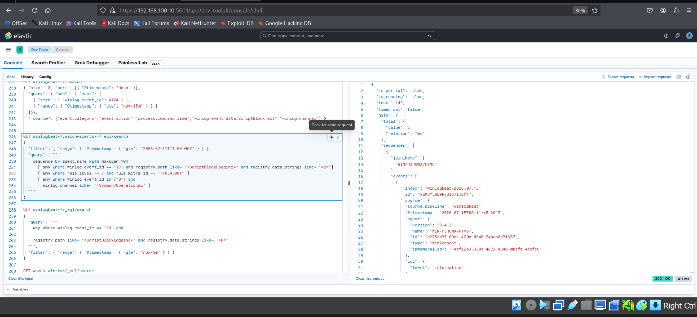

Figure 18: Kibana Dev Tool console

